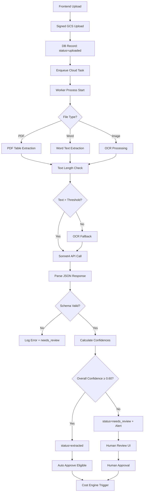

# ProCheff Şartname Ekstraksiyon Sistemi - Teslimat Paketi
## Sonnet Ekibi İçin Teknik Spesifikasyon v2.1

---

## 1.1. Şartname Girdi Formatları

### Desteklenen Dosya Türleri
- **PDF:** Native PDF, Scanned PDF (OCR gerekli)
- **Word:** .doc, .docx formatları
- **Görüntü:** .jpg, .png (OCR ile işleme)
- **Maksimum boyut:** 50MB
- **Dil:** Türkçe (öncelik), İngilizce destek

### Örnek Şartname İçeriği
```
ANKARA ŞEHİR HASTANESİ YEMEKHANESİ İŞLETME İHALESİ ŞARTNAME

1. GENEL BİLGİLER
- Proje Adı: Ankara Şehir Hastanesi Ana Yemekhane İşletmesi
- Yer: Ankara/Çankaya
- Sözleşme Süresi: 24 ay (2 yıl)
- Başlangıç: 01.01.2025, Bitiş: 31.12.2026

2. SERVİS KAPASITESI
- Günlük porsiyon: 3.000 kişi
- Öğün sayısı: 3 öğün (kahvaltı, öğle, akşam)
- Toplam aylık: 90.000 porsiyon

3. PORSİYON DETAYLARI
[Tablo]
Öğün Tipi    | Porsiyon (g) | Öğe Detayları
Kahvaltı     | 200g        | Ekmek 50g, Peynir 30g, Çay
Öğle         | 500g        | Ana yemek 200g, Pilav 150g, Salata 100g
Akşam        | 400g        | Ana yemek 180g, Sebze 120g, Çorba 100g
```

---

## 1.2. Beklenen Çıktı Şeması (JSON Schema)

```json
{
  "$schema": "http://json-schema.org/draft-07/schema#",
  "type": "object",
  "properties": {
    "project_name": {
      "type": ["string", "null"],
      "maxLength": 200,
      "description": "Proje tam adı"
    },
    "location": {
      "type": ["string", "null"],
      "maxLength": 100,
      "description": "Şehir/Bölge bilgisi"
    },
    "institution_type": {
      "type": ["string", "null"],
      "enum": ["hastane", "okul", "üniversite", "fabrika", "askeri", "kamu", "özel", null],
      "description": "Kurum kategorisi"
    },
    "start_date": {
      "type": ["string", "null"],
      "format": "date",
      "pattern": "^\\d{4}-\\d{2}-\\d{2}$",
      "description": "YYYY-MM-DD formatında başlangıç tarihi"
    },
    "end_date": {
      "type": ["string", "null"],
      "format": "date",
      "pattern": "^\\d{4}-\\d{2}-\\d{2}$",
      "description": "YYYY-MM-DD formatında bitiş tarihi"
    },
    "contract_duration_days": {
      "type": ["integer", "null"],
      "minimum": 1,
      "maximum": 3650,
      "description": "Sözleşme süresi (gün)"
    },
    "servings_per_day": {
      "type": ["integer", "null"],
      "minimum": 10,
      "maximum": 50000,
      "description": "Günlük toplam porsiyon sayısı"
    },
    "currency": {
      "type": ["string", "null"],
      "pattern": "^[A-Z]{3}$",
      "default": "TRY",
      "description": "ISO 4217 para birimi kodu"
    },
    "meal_types": {
      "type": "array",
      "items": {
        "type": "object",
        "properties": {
          "name": {
            "type": "string",
            "enum": ["kahvaltı", "öğle", "akşam", "ara_öğün"],
            "description": "Öğün adı"
          },
          "frequency_per_week": {
            "type": ["integer", "null"],
            "minimum": 1,
            "maximum": 7,
            "description": "Haftalık servis sıklığı"
          },
          "portion_gram_per_person": {
            "type": "integer",
            "minimum": 50,
            "maximum": 2000,
            "description": "Kişi başı porsiyon ağırlığı (gram)"
          },
          "menu_examples": {
            "type": "array",
            "items": {
              "type": "string",
              "maxLength": 100
            },
            "description": "Örnek menü öğeleri"
          }
        },
        "required": ["name", "portion_gram_per_person"]
      },
      "minItems": 1,
      "maxItems": 4
    },
    "dietary_restrictions": {
      "type": "array",
      "items": {
        "type": "string",
        "enum": ["helal", "vejeteryan", "vegan", "glütensiz", "diyabetik", "hipertansiyon", "böbrek_hastası"]
      },
      "description": "Özel diyet gereksinimleri"
    },
    "critical_requirements": {
      "type": "array",
      "items": {
        "type": "string",
        "maxLength": 200
      },
      "description": "Kritik lojistik/hijyen/servis şartları"
    },
    "notes": {
      "type": ["string", "null"],
      "maxLength": 1000,
      "description": "Ek notlar ve özel durumlar"
    },
    "confidence_score": {
      "type": "number",
      "minimum": 0.0,
      "maximum": 1.0,
      "description": "Genel güven skoru"
    },
    "field_confidences": {
      "type": "object",
      "properties": {
        "project_name": {"type": "number", "minimum": 0.0, "maximum": 1.0},
        "location": {"type": "number", "minimum": 0.0, "maximum": 1.0},
        "servings_per_day": {"type": "number", "minimum": 0.0, "maximum": 1.0},
        "start_date": {"type": "number", "minimum": 0.0, "maximum": 1.0},
        "meal_types": {"type": "number", "minimum": 0.0, "maximum": 1.0}
      },
      "description": "Alan bazlı güven skorları"
    },
    "snippets": {
      "type": "array",
      "items": {
        "type": "object",
        "properties": {
          "field": {"type": "string", "description": "İlgili alan adı"},
          "page": {"type": "integer", "minimum": 1, "description": "Sayfa numarası"},
          "short_text_reference": {
            "type": "string",
            "maxLength": 1000,
            "description": "Kaynak metin parçası"
          }
        },
        "required": ["field", "page", "short_text_reference"]
      }
    },
    "error": {
      "type": ["string", "null"],
      "maxLength": 500,
      "description": "Hata açıklaması (varsa)"
    }
  },
  "required": ["confidence_score", "field_confidences", "snippets"]
}
```

---

## 1.3. Field-Confidence Hesaplama Kuralları

### Güven Skoru Hesaplama Formülü
```javascript
FinalConfidence = 0.2 * ModelSelfConfidence + 0.5 * SourceEvidence + 0.3 * ParsingConfidence
```

### SourceEvidence Skorlaması
```javascript
const getSourceEvidence = (extractionSource) => {
  switch(extractionSource) {
    case 'table_cell': return 1.0
    case 'explicit_paragraph_match': return 0.9
    case 'multiple_overlapping_snippets': return 0.85
    case 'single_sentence_inference': return 0.55
    case 'model_inferred_no_source': return 0.10
    default: return 0.0
  }
}
```

### ParsingConfidence Skorlaması
```javascript
const getParsingConfidence = (fieldType, rawValue, parsedValue) => {
  if (fieldType === 'integer') {
    if (Number.isInteger(parsedValue)) return 1.0
    if (rawValue.includes('.') || rawValue.includes(',')) return 0.9
    return 0.0
  }
  if (fieldType === 'date') {
    if (moment(parsedValue, 'YYYY-MM-DD', true).isValid()) return 1.0
    return 0.0
  }
  return 1.0 // String fields
}
```

### Eşik Değerleri ve Aksiyonlar
| Confidence Range | Status | Action |
|-----------------|--------|---------|
| ≥ 0.90 | AUTO_APPROVED | Otomatik yeşil işaret, insan müdahalesi gereksiz |
| 0.60 - 0.89 | NEEDS_VERIFICATION | Sarı işaret, insan doğrulaması önerilir |
| < 0.60 | NEEDS_REVIEW | Kırmızı işaret, zorunlu manuel inceleme |

### Kritik Alanlar (Zorunlu Yüksek Güven)
- `servings_per_day`: Minimum 0.70 confidence
- `portion_gram_per_person`: Minimum 0.70 confidence
- `start_date`, `end_date`: Minimum 0.80 confidence

---

## 1.4. Extraction Pipeline Akış Diyagramı



### Pipeline SLA Targets
- **Upload to Queue:** < 5 seconds
- **Extraction Completion:** 
  - Median: < 60 seconds
  - P95: < 120 seconds
- **Schema Validation Pass Rate:** ≥ 98%

---

## 1.5. Hata Yönetimi & Fallback Politikası

### Task Retry Policy
```javascript
const retryPolicy = {
  maxAttempts: 3,
  initialDelay: '10s',
  maxDelay: '300s',
  backoffMultiplier: 2.0,
  retryableErrors: [
    'TIMEOUT',
    'RATE_LIMIT_EXCEEDED', 
    'TEMPORARY_API_ERROR'
  ]
}
```

### Hata Türleri ve Aksiyonlar
| Hata Tipi | Retry | Fallback | Status |
|-----------|-------|----------|---------|
| `PDF_PARSE_ERROR` | ✅ | OCR | retry_pdf_parse |
| `SONNET_API_TIMEOUT` | ✅ | Manual queue | retry_api_call |
| `INVALID_JSON_RESPONSE` | ✅ | Log + review | needs_review |
| `SCHEMA_VALIDATION_FAILED` | ❌ | Log + review | needs_review |
| `OCR_PROCESSING_FAILED` | ❌ | Manual processing | manual_processing |

### OCR Fallback Kuralları
```javascript
const shouldUseOCR = (document) => {
  return (
    document.type === 'image' ||
    document.extractedText.length < 500 ||
    document.extractedText.match(/[^\x20-\x7E]/g)?.length > 100
  )
}
```

### Error Logging Format
```json
{
  "error_id": "uuid",
  "spec_id": "uuid", 
  "error_type": "PDF_PARSE_ERROR",
  "error_message": "Could not extract tables from PDF",
  "retry_count": 2,
  "created_at": "2025-01-15T10:30:00Z",
  "resolved_at": null,
  "resolution_method": "ocr_fallback"
}
```

---

## 1.6. Güvenlik Gereksinimleri

### GCS Bucket Konfigürasyonu
```yaml
bucket_config:
  name: "procheff-specifications-prod"
  location: "europe-west1"
  versioning: enabled
  lifecycle_rules:
    - delete_after_days: 365
  iam_bindings:
    - role: "roles/storage.objectViewer"
      members: ["serviceAccount:worker@procheff.iam"]
    - role: "roles/storage.objectCreator" 
      members: ["serviceAccount:upload@procheff.iam"]
```

### Secret Management
```yaml
secrets:
  - name: "sonnet-api-key"
    version: "pinned-v3"
    access_policy: "worker-only"
  - name: "db-connection-string"
    version: "latest"
    rotation_schedule: "monthly"
```

### Data Masking Kuralları
```javascript
const maskSensitiveData = (text) => {
  // TC Kimlik No masking
  text = text.replace(/\b\d{11}\b/g, '[TC_MASKED]')
  
  // Telefon numarası masking  
  text = text.replace(/\b\d{3}[\s\-]\d{3}[\s\-]\d{4}\b/g, '[PHONE_MASKED]')
  
  // Email masking
  text = text.replace(/\b[A-Za-z0-9._%+-]+@[A-Za-z0-9.-]+\.[A-Z|a-z]{2,}\b/g, '[EMAIL_MASKED]')
  
  return text
}
```

### Audit Logging
```json
{
  "action": "spec_extraction_approved",
  "user_id": "user123",
  "spec_id": "spec456", 
  "extraction_id": "ext789",
  "changes_made": {
    "servings_per_day": {"from": 2000, "to": 2500},
    "confidence_override": true
  },
  "timestamp": "2025-01-15T14:22:00Z",
  "ip_address": "192.168.1.100",
  "user_agent": "Mozilla/5.0..."
}
```

---

## 1.7. QA/Acceptance Kriterleri

### Functional Requirements
- [ ] **FR-001:** PDF upload → extraction task queued < 5 seconds
- [ ] **FR-002:** Extraction completion median < 60s, P95 < 120s  
- [ ] **FR-003:** Schema validation pass rate ≥ 98%
- [ ] **FR-004:** Critical field F1 score ≥ 0.90 on test set
- [ ] **FR-005:** Overall confidence < 0.60 → auto needs_review trigger

### Test Vaka Örnekleri
```javascript
const testCases = [
  {
    name: "Standard Hospital Specification",
    input: "ankara_hastane_sartname.pdf",
    expected: {
      project_name: "Ankara Şehir Hastanesi Yemekhane",
      servings_per_day: 3000,
      meal_types: [
        {name: "öğle", portion_gram_per_person: 500}
      ],
      confidence_score: "> 0.80"
    }
  },
  {
    name: "Scanned Poor Quality PDF",
    input: "low_quality_scan.pdf", 
    expected: {
      error: null,
      confidence_score: "> 0.40",
      snippets: "length > 0"
    }
  },
  {
    name: "Multi-table Complex Specification",
    input: "complex_multi_table.pdf",
    expected: {
      meal_types: "length >= 2",
      field_confidences: {
        meal_types: "> 0.70"
      }
    }
  }
]
```

### Performance Benchmarks
| Metric | Target | Measurement Method |
|--------|--------|--------------------|
| Upload Success Rate | ≥ 99.5% | Frontend upload completion ratio |
| Extraction Success Rate | ≥ 90% | Worker job completion ratio |
| API Response Time | < 30s P95 | Sonnet4 API call latency |
| Review UI Load Time | < 2s | Frontend page load time |
| False Positive Rate | < 5% | Manual validation of auto-approved extractions |

---

## 1.8. Eğitim Veri Koleksiyonu

### Veri Formatı
```json
{
  "training_example_id": "train_001",
  "original_document": {
    "filename": "sample_spec.pdf",
    "gcs_path": "gs://training-data/sample_spec.pdf",
    "document_type": "specification",
    "pages": 12
  },
  "raw_text_snippet": "Günlük 3.000 porsiyon ana yemek servisi yapılacaktır...",
  "sonnet_output": {
    "servings_per_day": 3000,
    "confidence_score": 0.85
  },
  "human_corrected": {
    "servings_per_day": 3000,
    "confidence_score": 0.95,
    "correction_reason": "Correct extraction, high confidence"
  },
  "annotation_metadata": {
    "annotator_id": "ann_123",
    "annotation_time_seconds": 45,
    "annotation_date": "2025-01-15",
    "quality_score": "high"
  }
}
```

### Canonical Değer Kuralları
```javascript
const canonicalizationRules = {
  dates: {
    input_formats: ["DD.MM.YYYY", "DD/MM/YYYY", "YYYY-MM-DD"],
    output_format: "YYYY-MM-DD"
  },
  numbers: {
    decimal_separator: ".",
    thousand_separator: "",
    remove_currency_symbols: true
  },
  portions: {
    unit_normalization: {
      "kişi": "person",
      "porsiyon": "portion", 
      "adet": "piece"
    }
  }
}
```

### Minimum Dataset Gereksinimleri
- **Phase 1 (MVP):** 200-300 high-quality pairs
- **Phase 2 (Production):** 500-750 validated examples  
- **Phase 3 (Optimization):** 1000+ diverse examples

### Veri Kalite Kontrol
```javascript
const qualityChecks = {
  snippet_relevance: (snippet, field) => {
    // Snippet ile field arasında relevance score
    return calculateRelevanceScore(snippet, field) > 0.7
  },
  human_consistency: (corrections) => {
    // Aynı text için farklı annotator'lar tutarlı mı
    return calculateInterAnnotatorAgreement(corrections) > 0.85
  },
  coverage_completeness: (dataset) => {
    // Tüm field tiplerini kapsıyor mu
    return checkFieldCoverage(dataset) > 0.90
  }
}
```

---

## Production Deployment Checklist

### Pre-deployment
- [ ] Staging environment QA passed (all acceptance criteria)
- [ ] Security review completed (penetration test, code review)
- [ ] Infrastructure checklist validated (monitoring, alerting, backup)
- [ ] Database migration rollback plan prepared
- [ ] Load testing completed (2x expected traffic)

### Deployment Process
- [ ] Blue-green deployment with traffic gradual shift
- [ ] Database migration with snapshot backup
- [ ] Monitoring dashboard active with alerts
- [ ] Rollback procedure documented and tested

### Post-deployment
- [ ] Smoke tests passed on production
- [ ] Error rates within acceptable thresholds
- [ ] Performance metrics meeting SLA targets
- [ ] 24h monitoring period completed

---

## API Endpoints Spesifikasyonu

### Upload Endpoint
```http
POST /api/specifications/upload
Content-Type: multipart/form-data

Headers:
  Authorization: Bearer {jwt_token}
  
Body:
  file: [binary_file]
  metadata: {
    "project_type": "hospital",
    "urgency": "normal",
    "expected_language": "tr"
  }

Response:
{
  "spec_id": "uuid",
  "upload_status": "success", 
  "processing_eta_seconds": 60,
  "signed_url": "https://..."
}
```

### Status Check Endpoint
```http
GET /api/specifications/{spec_id}/status

Response:
{
  "spec_id": "uuid",
  "status": "extracted|needs_review|processing",
  "confidence_score": 0.85,
  "estimated_completion": "2025-01-15T10:35:00Z"
}
```

### Extraction Results Endpoint
```http
GET /api/specifications/{spec_id}/extraction

Response:
{
  "extraction_id": "uuid",
  "extraction_data": { /* JSON Schema format */ },
  "requires_review": false,
  "review_url": "/review/{extraction_id}"
}
```

---

Bu teslimat paketi Sonnet ekibinin tam olarak neyi implement edeceğini, hangi kalite standartlarını karşılaması gerektiğini ve sistemi nasıl entegre edeceğini açıkça tanımlamaktadır.